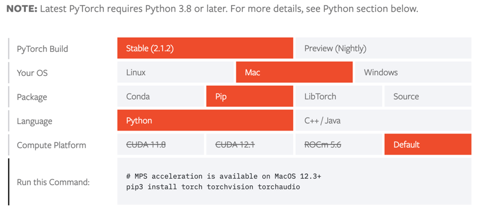

# 인공지능 프로젝트 모음집에 있는 것을 직접 구현해보기!

# Macos pytorch Installation

1. create conda environment

```bash
conda create -n "pytorch" python=3.8
```
2. execute conda environment

```bash
conda activate pytorch
```

3. installation pytorch (mac ver)



```bash
pip3 install torch torchvision torchaudio
```

# Projects List

| Name              | Content                |
|-------------------|------------------------|
| 손글씨 숫자 이미지 분류 문제  | 손글씨 숫자 이미지를 분류합니다.     |
| 작물 잎 사진으로 질병 분류하기 | 작물 잎 사진을 통해 질병을 분류합니다. |


